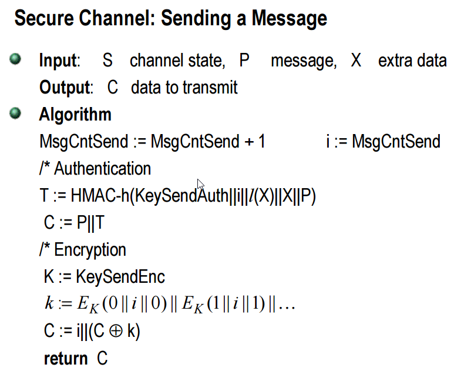

# secure-channel

<p>
  
</p>

Secure channel provides a secure means of communicating where eavesdropping is not possible, and it happens through secure RSA Encryption 

## Installation

```
$ git clone github.com/sap200/secure-channel

$ cd secure-channel

$ go install 
```

or 

you can directly install the binary

For linux

```
$ curl https://github.com/sap200/secure-channel/releases/download/v0.1-beta/secure-channel

$ sudo mv secure-channel /usr/local/bin
```

For Windows

```
C:\users>curl https://github.com/sap200/secure-channel/releases/download/v0.1-beta/secure-channel.exe
```

## Usage

```
$ ./secure-channel -h

Usage of ./secure-channel:

  -command string

    	command: either server or client

  -ip string

    	ip: if command is server then launch ip, if command is client then server's ip  to connect

  -port uint

    	port: if command is server then launch port, if command is client then server's port to connect
```

For Server

```
$ ./secure-channel -command server -ip <ipv4> -port <PORT>
```

For Client 

```
$ ./secure-channel -command client -ip <ipv4> -port <PORT>
```

## Use over local network

```
$ ./secure-channel -command server -ip localhost -port 8080

$ socat tcp-listen:1234,fork,reuseaddr tcp:127.0.0.1:8080

$ ./secure-channel -command client -ip 192.168.3.237 -port 1234

```


😊 your secure channel is established. Enjoy your secret conversation with no eavesdropping.

## Internals

### Packets

Packet Interface

```go
type Packet interface {
	Marshall() (string, error)
}
```

Syn Packet

``` go
type SynPacket struct {
	PubKey  rsa.PublicKey `json:"pub_key"`
	Message string        `json:"message"`
}
```

Acknowledgement packet

``` go
type AckPacket struct {
	AckStatus int64         `json:"ack_status"`
	PubKey    rsa.PublicKey `json:"pub_key"`
	Message   string        `json:"message"`
}
```

Message Packet

```go
type MsgPacket struct {
	Cipher    []byte `json:"cipher"`
	Signature []byte `json:"signature"`
}
```

## Acknowledgement status

```go
const (
	AckFail = iota
	AckSuccess
)
```


